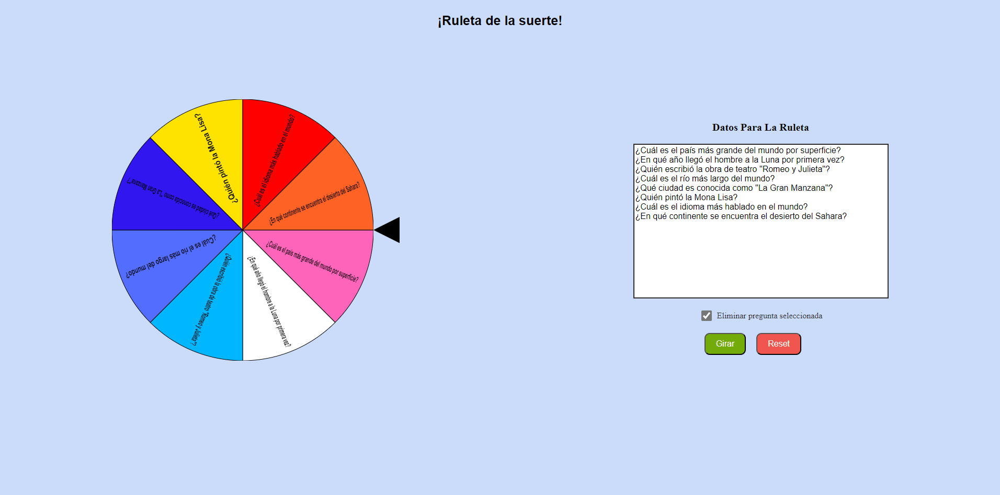

# Roulette App

¡Bienvenido a la Roulette App! Esta aplicación web permite a los usuarios crear y girar una ruleta personalizada con diferentes opciones. Está construida con React y TypeScript, y utiliza Vite como herramienta de construcción.

Puedes probar la aplicación en vivo en el siguiente enlace: [Roulette App en Vivo](https://lucky-roulette.netlify.app/)



## Características

- **Ruleta Personalizada**: Los usuarios pueden ingresar sus propias opciones para la ruleta.
- **Animación de Giro**: La ruleta gira con una animación suave y selecciona una opción al azar.
- **Interfaz Intuitiva**: La aplicación tiene una interfaz de usuario simple y fácil de usar.
- **Context API**: Utiliza la Context API de React para manejar el estado global de las preguntas.

## Estructura del Proyecto

```
roulette-app/
├── .gitignore
├── eslint.config.js
├── index.html
├── package.json
├── public/
├── README.md
├── src/
│   ├── App.css
│   ├── App.tsx
│   ├── assets/
│   ├── components/
│   │   ├── button/
│   │   │   └── Button.tsx
│   │   └── wheel/
│   │       ├── Wheel.css
│   │       └── Wheel.tsx
│   ├── context/
│   │   ├── useWheelContext.tsx
│   │   ├── wheelContext.tsx
│   │   └── wheelProvider.tsx
│   ├── hooks/
│   │   └── useWheel.tsx
│   ├── index.css
│   ├── lib/
│   │   └── conts.ts
│   ├── main.tsx
│   ├── pages/
│   │   └── WheelPage.tsx
│   └── vite-env.d.ts
├── tsconfig.app.json
├── tsconfig.json
├── tsconfig.node.json
└── vite.config.ts
```

## Instalación

1. Clona el repositorio:
   ```sh
   git clone https://github.com/tu-usuario/roulette-app.git
   ```
2. Navega al directorio del proyecto:
   ```sh
   cd roulette-app
   ```
3. Instala las dependencias:
   ```sh
   npm install
   ```

## Uso

1. Inicia el servidor de desarrollo:
   ```sh
   npm run dev
   ```
2. Abre tu navegador y navega a `http://localhost:5173` para ver la aplicación en acción.

## Scripts Disponibles

- `npm run dev`: Inicia el servidor de desarrollo.
- `npm run build`: Compila la aplicación para producción.
- `npm run lint`: Ejecuta ESLint para encontrar y arreglar problemas en el código.
- `npm run preview`: Previsualiza la aplicación compilada.

## Contribución

¡Las contribuciones son bienvenidas! Si tienes alguna sugerencia o encuentras algún problema, por favor abre un issue o envía un pull request.

## Licencia

Este proyecto está licenciado bajo la Licencia MIT. Consulta el archivo LICENSE para más detalles.

---

¡Gracias por usar la Roulette App!